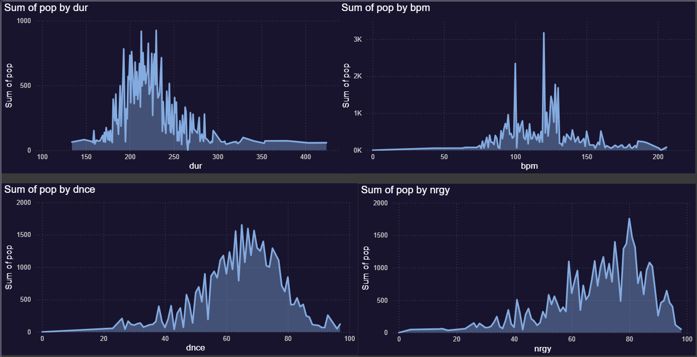
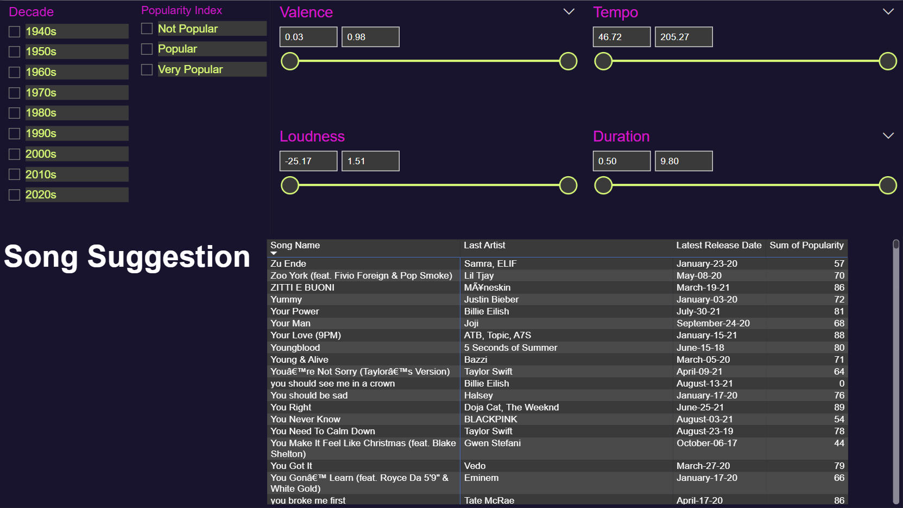
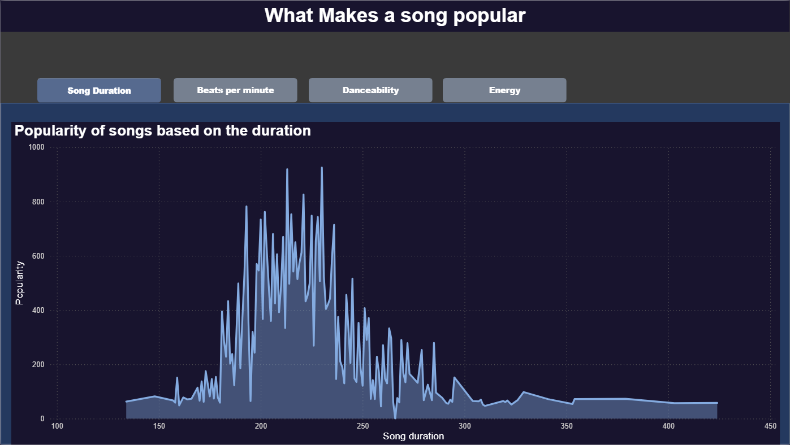
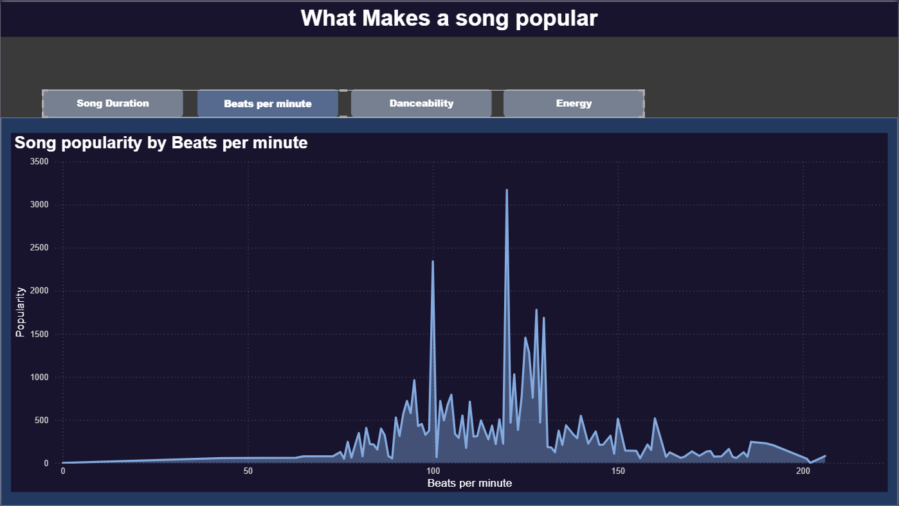
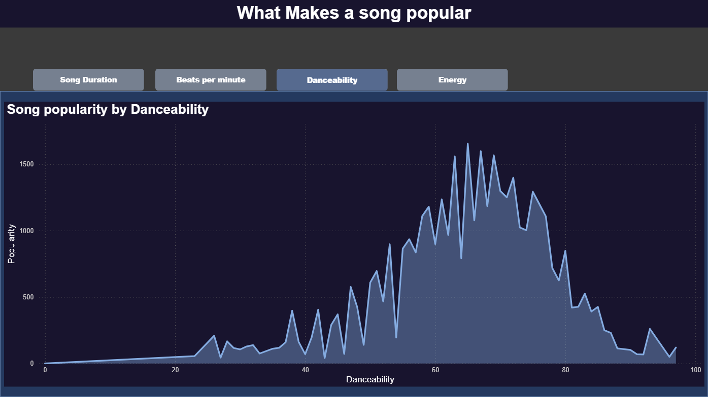
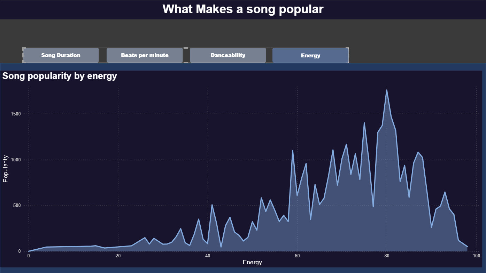

# 🎵 Power BI Spotify Music Insights

---

## ✅ Overview
This repository demonstrates a fully interactive **Power BI dashboard** analyzing Spotify streaming data. It applies multiple advanced **Power BI concepts** to explore track popularity, mood-based segmentation, and song recommendation systems.

✔️ Star Schema Data Model  
✔️ Custom DAX Measures & KPIs  
✔️ Interactive UX with Bookmarks & Navigation  
✔️ Drillthroughs, Tooltips, and Slicers  
✔️ Real-time Filtering & Mood Clustering  

---

## 📊 Dataset Summary
- **Source**: Spotify API / Kaggle Dataset  
- **Tracks**: ~10,000+  
- **Features**: Danceability, Energy, Acousticness, Valence, Popularity, Genre, Artist

---

## 🧠 Power BI Concepts Applied

### 📐 Data Modeling & Calculations
- Star schema with central `Tracks` fact table linked to `Artists`, `Genres`, `Dates`
- Custom DAX measures:
  - Top N Songs by Metric
  - Dynamic Ranking by Popularity, Danceability, Energy
  - Average by Cluster
  - Mood/Valence calculation

### 🎛️ Interactivity & UX
- **Bookmarks**: Mood toggles (Chill, Energetic, Acoustic), UI simulation  
- **Page Navigation**: Button-based transitions between pages  
- **Slicers & Sync**: Global filters (genre, year), slicer syncing  
- **Drillthrough Pages**: Song-level insights with acoustic details  
- **Custom Tooltips**: Contextual popups for visuals  
- **Dynamic Titles**: DAX-driven slicer-responsive headings  

---

## 📊 Reports Included

### 🎧 Music Insights Report (`Music.pbix`)
Tracks trends by:
- Popularity
- Danceability
- Energy
- Acousticness
- Valence

---

### 📻 Mood-Based Recommendation Engine (`song suggestion.pbix`)
Simulates a recommendation system using:
- Mood clusters (Chill, Energetic, Acoustic)
- DAX logic for mood classification
- Navigation via bookmarks

  
 
---

## 💼 Business & Technical Value
This project demonstrates how Power BI can:
- Simulate recommendation engines
- Mimic app-like UI with navigation and mood toggles
- Enable data storytelling with mood and genre filters
- Support music data exploration and cluster-based personalization

---

## 🛠 Tech Stack
- Power BI Desktop  
- Power Query (M)  
- DAX for measures and UX logic  
- GitHub (for versioning & documentation)  
- *(Optional)* Power BI Service for deployment

---

## 🧪 How to Use
1. Clone or download this repository
2. Open `Music.pbix` or `song suggestion.pbix` in Power BI Desktop
3. Use slicers and mood filters to explore insights
4. Navigate with bookmarks and buttons
5. Click on songs for detailed drillthroughs

---

## 🚀 Next Enhancements
- Spotify API integration for real-time data  
- Power Automate to generate playlists  
- Mood clustering in Power Query  
- Power Apps for interactive feedback  

---

✅ *This is a portfolio-grade Power BI project built to demonstrate DAX mastery, advanced UX interactivity, and real-world business storytelling.*

